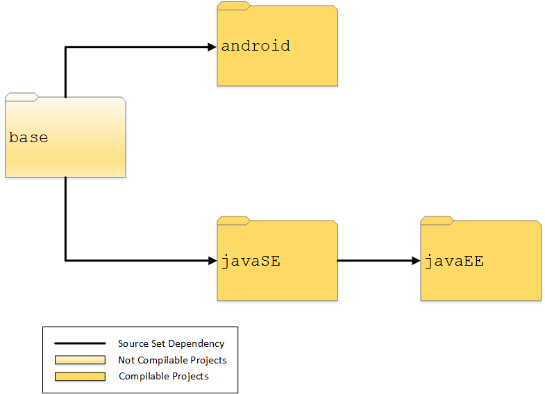

[](https://github.com/smartdevicelink/sdl_java_suite/actions)
[](https://codecov.io/gh/smartdevicelink/sdl_java_suite)
[](http://slack.smartdevicelink.com)

# SmartDeviceLink (SDL)

SmartDeviceLink (SDL) is a standard set of protocols and messages that connect applications on a smartphone to a vehicle head unit. This messaging enables a consumer to interact with their application using common in-vehicle interfaces such as a touch screen display, embedded voice recognition, steering wheel controls and various vehicle knobs and buttons. There are three main components that make up the SDL ecosystem.

  * The [Core](https://github.com/smartdevicelink/sdl_core) component is the software which Vehicle Manufacturers (OEMs)  implement in their vehicle head units. Integrating this component into their head unit and HMI based on a set of guidelines and templates enables access to various smartphone applications.
  * The optional [SDL Server](https://github.com/smartdevicelink/sdl_server) can be used by Vehicle OEMs to update application policies and gather usage information for connected applications.
  * The App Libraries - [Android](https://github.com/smartdevicelink/sdl_java_suite), [iOS](https://github.com/smartdevicelink/sdl_ios), [JavaScript](https://github.com/smartdevicelink/sdl_javascript_suite), [JavaSE](https://github.com/smartdevicelink/sdl_java_suite) (Embedded), and [JavaEE](https://github.com/smartdevicelink/sdl_java_suite) (Cloud) - are implemented by app developers into their applications to enable command and control of a connected head unit.

Pull Requests Welcome!

To understand if a contribution should be entered as a Java Suite Pull Request (or issue), or an SDL Evolution Proposal, please reference [this document](https://github.com/smartdevicelink/sdl_evolution/blob/master/proposals_versus_issues.md).

<a href="http://www.youtube.com/watch?feature=player_embedded&v=AzdQdSCS24M" target="_blank"></a>

## App Library

The app library component of SDL is meant to run on the end user’s smart-device from within SDL enabled apps, as an embedded app, or connected to the cloud. App libraries allow the apps to connect to SDL enabled head-units and hardware through bluetooth, USB, and TCP for Android, and cloud and embedded apps can connect through web sockets, Java Beans, and other custom transports. Once the library establishes a connection between the smart device and head-unit through the preferred method of transport, the two components are able to communicate using the SDL defined protocol. The app integrating this library project is then able to expose its functionality to the head-unit through text, media, and other interactive elements.

# SmartDeviceLink Java Suite

You can find guides and API Reference Documentation specific to SDL Android, JavaSE, and JavaEE libraries on [smartdevicelink.com](https://smartdevicelink.com/docs/).

Contents and timing for SDL Java Suite releases can be tracked on the [GitHub Projects](https://github.com/smartdevicelink/sdl_java_suite/projects) page.

Additional information about recent and upcoming SDL Releases can be found in the [SDL Evolution README](https://github.com/smartdevicelink/sdl_evolution#recent-and-upcoming-releases).

## SmartDeviceLink Android
[](https://maven-badges.herokuapp.com/maven-central/com.smartdevicelink/sdl_android/)

### Installation

#### Dependency Managers

To compile with the latest release of SDL Android, include the following in your app's `build.gradle` file,

```sh
repositories {
    mavenCentral()
}
dependencies {
    implementation 'com.smartdevicelink:sdl_android:5.+'
}
```

For Maven or Ivy snippets please look at [Maven Central](https://search.maven.org/artifact/com.smartdevicelink/sdl_android)

#### Manually

If you prefer not to use any of the aforementioned dependency managers, you can integrate SDL Android into your project manually.

### Proguard Rules

Developers using Proguard to shrink and obfuscate their code should be sure to include the following lines in their proguard-rules.pro file:

```sh
-keep class com.smartdevicelink.** { *; }
-keep class com.livio.** { *; }
# Video streaming apps must add the following line
-keep class ** extends com.smartdevicelink.streaming.video.SdlRemoteDisplay { *; }
```

## SmartDeviceLink Java

### JavaSE

[](https://maven-badges.herokuapp.com/maven-central/com.smartdevicelink/sdl_java_se/)

The JavaSE project is meant to allow SDL compatibility for embedded applications. 

#### Dependency Managers

To compile with the latest release of SDL JavaSE, include the following in your app's `build.gradle` file,

```sh
repositories {
    mavenCentral()
}
dependencies {
    implementation 'com.smartdevicelink:sdl_java_se:5.+'
}
```

### JavaEE

[](https://maven-badges.herokuapp.com/maven-central/com.smartdevicelink/sdl_java_ee/)

The JavaEE project is meant to allow SDL compatibility for web applications. 

#### Dependency Managers

To compile with the latest release of SDL JavaEE, include the following in your app's `build.gradle` file,

```sh
repositories {
    mavenCentral()
}
dependencies {
    implementation 'com.smartdevicelink:sdl_java_ee:5.+'
}
```

#### Manually building a JAR

If you prefer making a JAR, simply call:

```sh
gradle build
```
from within the project (JavaSE or JavaEE) and a JAR should be generated in the `build/libs` folder

## Java Suite Repo Structure



#### base Folder
The base folder contains the source set that is shared between all of the compilable projects. This folder does not contain a compilable project. 

#### android Folder 
The android folder contains the SDL Android library as well as the sample project for Android. Both of those are compilable projects. 

#### javaSE
The javaSE folder contains the SDL JavaSE Library. The base folder source set is added as a dependency. This project can be used for embedded or remote SDL applications. It uses a web socket transport by default but can be made to work with other transports via the `CustomTransport`.

###### JavaSE Sample App
The JavaSE sample app is in the hello_sdl_java folder. It demonstrates an efficient way to structure a Java app using the JavaSE library.

#### javaEE
The javaEE folder contains the SDL JavaEE library. The JavaSE folder is used as a source set and added as a dependency. This library is based off the JavaSE library and will contain specifics for the JavaEe platform.

###### JavaEE Sample App
The JavaEE sample app is in the hello_sdl_java_ee folder. Most of the code is commented out since the library and sample app do not include the dependencies of JavaEE due to licensing issues. However, the commented out code demonstrates how to build a Java based app into the JavaEE bean architecture.  
